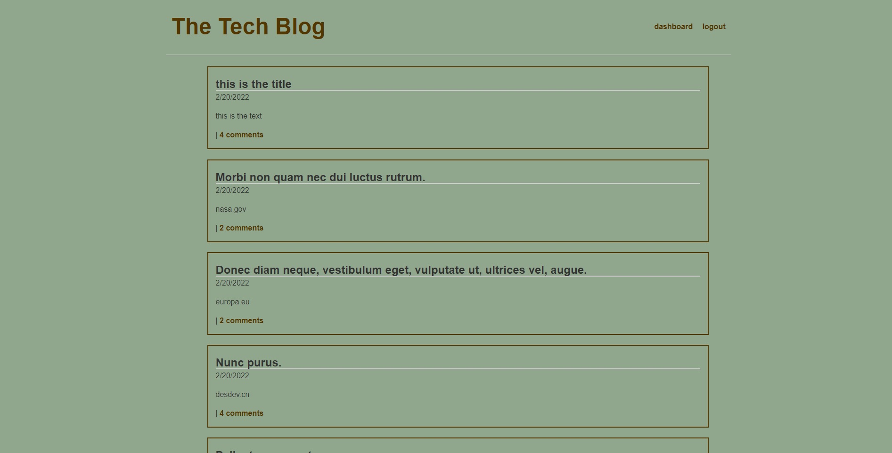

# Tech Blog

## description
Ever wanted a place were you can see all the latest news and updates on tech? This is the place for it. This app creates a place for those who are interested in tech to post and discuss tech relate articles and ideas. All you have to do is make a account and you too can most blog posts and comment/discuss on other users blog posts as well.

## Table of Contents
* [Installation](#installation)
* [Usage](#usage)

## Installation
Since this is not a fully deployed application, the only thing needed to use this app properly is to have all of the npm packages installed. This can be done by using npm i as all of the depencies have already been set up in the package.json. Once that is done, all you have to do is use npm start and open up localhost:3001. 

## Usage
Once you have the application up and running you will first need to create a account in order to participate in posting and commenting, although you may view blogs posts without createing a account. You can create a account by clicking the login button at the top right of the screen, if you do not one have account there will be a section for which you can signup with one. Once you create a account you will then see a comment section on the homepage underneath all of the blog posts, there you may interact and disucss the blog post, or you can go to your dashboard (located at the top right of the screen) which will take you to a page were you can make your own posts!

Image of the deployed app 
